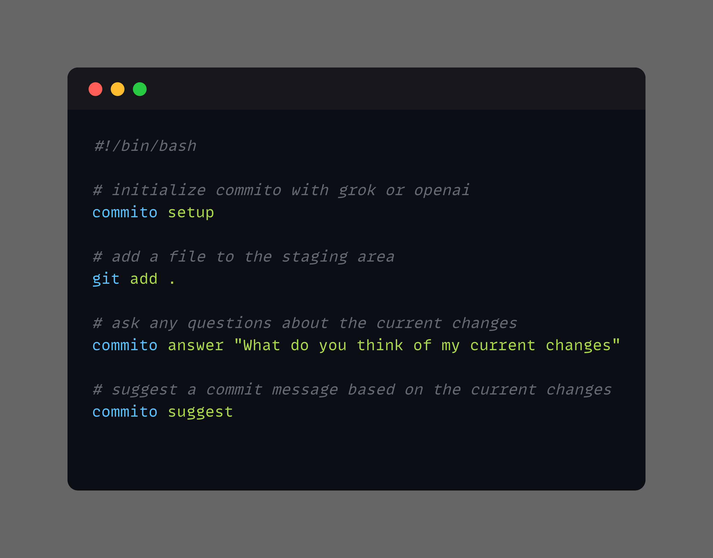

# Commito

`commito` is an AI-powered tool that helps developers craft meaningful commit messages and get insights about their code changes.



It analyzes your git diffs and provides intelligent suggestions through an LLM interface.

## Features

- Commit Message Suggestions: Get AI-generated, context-aware commit message suggestions
- Code Change Analysis: Ask questions about your current changes and get intelligent responses
- Easy Setup: Simple configuration process to get started quickly

## Installation

You can install `commito` using the following command:
```bash
go install github.com/realzai/commito@latest
```

Or

You can download the latest release from the [releases page](
https://github.com/realzai/commito/releases
) and add it to your PATH.

## License

MIT License

## Support

Having issues? Open an issue on my GitHub repository.